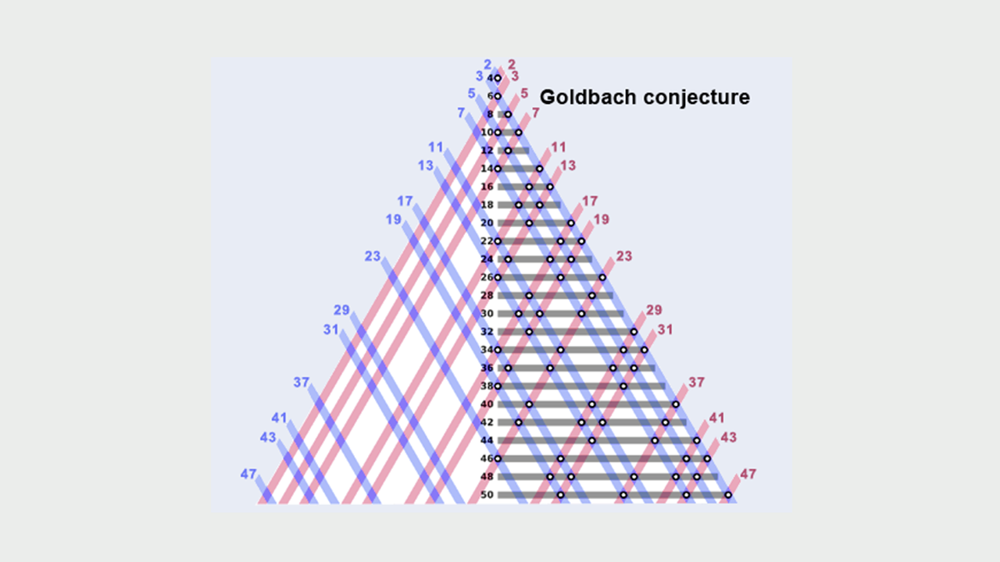

# Experimental Results on Goldbach's Conjecture

This work builds upon [Geometric Insights into the Goldbach Conjecture](https://github.com/frankvegadelgado/goldbach).

## Computational Analysis

We conducted an extensive computational experiment to validate the geometric perspective on Goldbach's conjecture. The experiment analyzed the cardinality of valid M-values (denoted as $|D_N|$) for integers $N$ in the range $4 \leq N \leq 2^{14}$ (16,384).

### Experimental Setup
- **Platform**: Standard workstation (11th Gen Intel i7, 32GB RAM)
- **Implementation**: Python 3.12 with Gmpy2 library for efficient prime number operations
- **Methodology**: Deterministic computation of $|D_N|$ for each $N$ in the specified range

### Key Metric: Gap Function
We defined a gap function to measure the density of valid M-values:
$$G(N) = \log^{2}(2N) - (N - |D_N|)$$

where

$$D_N = \\{M = \frac{Q - P}{2} \mid 2 < P < N < Q < 2N, \text{ and } P, Q \text{ are prime}\\}.$$

### Results Summary

| Interval (m) | Range $[2^m, 2^{m+1}]$ | Minima at N | Min G(N) Value |
|--------------|------------------------|-------------|----------------|
| 2 | $[4, 8]$ | 5 | 1.301898 |
| 3 | $[8, 16]$ | 11 | 4.554543 |
| 4 | $[16, 32]$ | 17 | 7.435219 |
| 5 | $[32, 64]$ | 61 | 11.078618 |
| 6 | $[64, 128]$ | 73 | 14.836335 |
| 7 | $[128, 256]$ | 151 | 17.608977 |
| 8 | $[256, 512]$ | 269 | 20.537165 |
| 9 | $[512, 1024]$ | 541 | 25.812111 |
| 10 | $[1024, 2048]$ | 1327 | 30.154668 |
| 11 | $[2048, 4096]$ | 2161 | 32.081569 |
| 12 | $[4096, 8192]$ | 7069 | 39.329014 |
| 13 | $[8192, 16384]$ | 14138 | 41.057758 |

### Key Findings

1. **Consistent Positivity**: $G(N) > 0$ for all tested $N$, indicating:
   $$|D_N| > N - \log^{2}(2N)$$

2. **Monotonic Growth**: The minimum value of $G(N)$ strictly increases across successive power-of-two intervals, demonstrating robust growth in the density of valid M-values.

3. **Empirical Lower Bound**: The experimental data provides strong evidence that the number of "bad" M-values (those not in $D_N$) is bounded by $\log^{2}(2N)$.

### Implications

These results support the main theoretical conclusion that for every $N \geq 4$, there exists at least one valid M-value in the range $[1, N-3]$ such that both $P = N - M$ and $Q = N + M$ are prime, thereby verifying the Goldbach conjecture variant for even integers $\geq 8$.

The increasing trend in $G(N)$ minima suggests that the conjecture becomes progressively easier to satisfy as $N$ grows larger, aligning with known asymptotic results in prime number theory.
